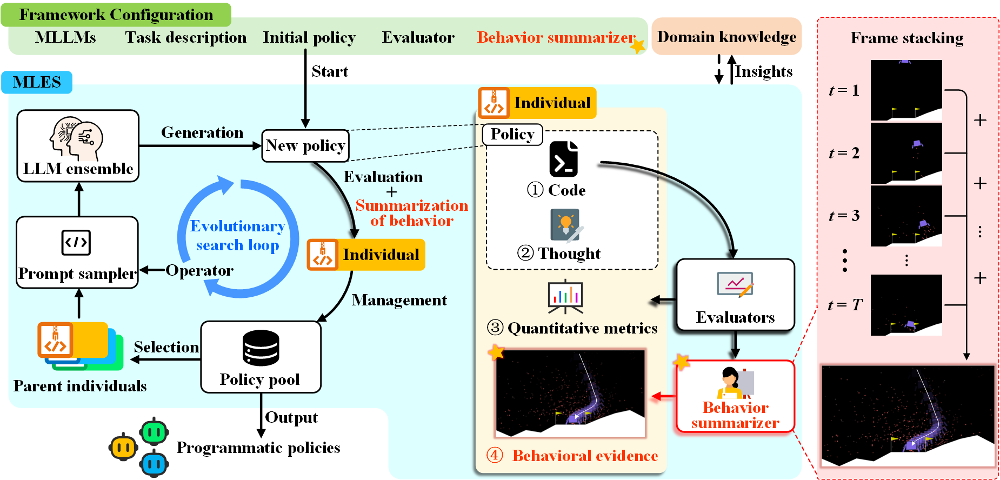
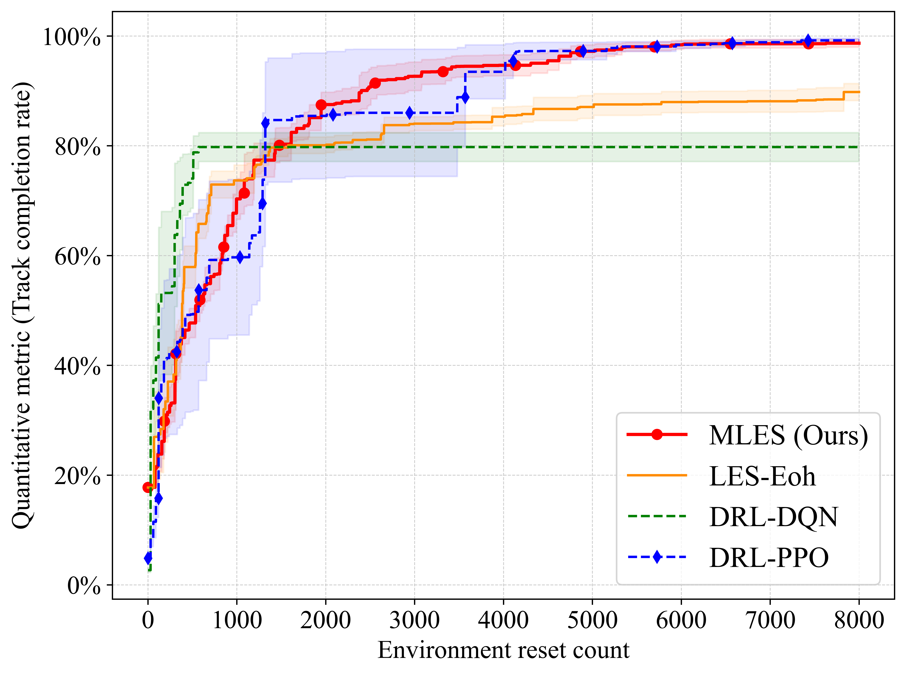

<div align="center">
<h1 align="center">MLES: Multimodal LLM-Assisted Evolutionary Search for Programmatic Control Policies</h1>

[](https://iclr.cc/)
[]()
[]()

<h3 align="center">Automated discovery of high-performing, interpretable, and verifiable control policies</h3>

**TL;DR:** MLES replaces opaque Deep Reinforcement Learning (DRL) black-box policies by using Multimodal LLMs to automatically design human-readable Python code for **interpretability-critical** control tasks.

[//]: # ([Paper]&#40;https://github.com/Optima-CityU/LLM4AD/tree/main/example&#41;)

</div>
<br>

---

## 📑 Table of Contents
- [📢 News](#-news)
- [📖 What is MLES?](#-what-is-mles)
- [✨ Key Advantages](#-key-advantages)
- [⚙️ Requirements & Installation](#️-requirements--installation)
- [💻 Quick Start: Car Racing](#-quick-start-car-racing)
- [📊 Analyzing Your Results](#-analyzing-your-results)
- [🛠️ Adapting to Custom Scenarios](#️-adapting-to-custom-scenarios)
- [🎓 Citation](#-citation)

---

---
## 📢 News
* **[2026-02]** 🔥 MLES has been integrated into the **[LLM4AD](https://github.com/Optima-CityU/llm4ad)** platform! LLM4AD is a comprehensive library for LLM-assisted algorithm design. You can now easily benchmark MLES against various other LLM-assisted Evolutionary Search methods. We welcome you to try it out!
* **[2025-12]** 🎉 Our paper *"Multimodal LLM-Assisted Evolutionary Search for Programmatic Control Policies"* has been accepted by **ICLR 2026**!
---

## 📖 What is MLES?

Transparency and high performance are essential goals in designing control policies, particularly for safety-critical tasks. While Deep Reinforcement Learning (DRL) algorithms have dominated this space, their **"black-box"** nature makes them difficult to trust, debug, and safely deploy.

**MLES (Multimodal LLM-assisted Evolutionary Search)** offers a paradigm shift. It combines the advanced vision-language reasoning and code-generation capabilities of Multimodal Large Language Models (MLLMs) with the iterative optimization strengths of evolutionary computation.

### How it Works 🧠
MLES is designed to mimic how human experts develop policies:
1. **Generates Code:** Synthesizes control policies as raw, interpretable Python code.
2. **Visual Feedback Loop:** Unlike standard trial-and-error methods, MLES scrutinizes visual execution traces to generate **Behavioral Evidence (BE)**.
3. **Diagnostic Refinement:** By analyzing the BE images, the MLLM identifies *why* a policy failed (e.g., "reward hacking" or late braking) and implements targeted, code-level improvements.

<p align="center">

</p>

### 🆚 DRL vs. LES vs. MLES

| Feature | 🤖 Traditional DRL (e.g., PPO/DQN) | 📝 Standard LES (e.g., EoH)             | 🚀 MLES (Ours) |
| :--- | :--- | :--- | :--- |
| **Policy Representation** | Opaque Neural Networks | **Human-readable Python Code** | **Human-readable Python Code** |
| **Optimization Guide** | Scalar Rewards | Scalar Metrics                          | **Visual Feedback + Scalar Metrics** |
| **Policy Discovery Process**| Black-box, hard to trace | Trial-and-error, lacks diagnostic depth | **Diagnostic, step-by-step traceable** |
| **Performance** | High | Moderate                                | **High (Comparable to PPO)** |

### ✨ Key Advantages

1. 🔍 **Completely Transparent Control Policies**: Policies are directly synthesized as human-readable Python programs, making their logic entirely transparent, modular, and easily understandable.
2. 🏥 **Traceable & Diagnostic Policy Design**: Every step of the policy evolution is meticulously recorded. The evolutionary process is driven by behavioral evidence, transforming stochastic trial-and-error into a grounded, diagnostic refinement process.
3. 🏎️ **Competitive Performance**: MLES achieves performance comparable to **Proximal Policy Optimization (PPO)** across standard control tasks (e.g., Lunar Lander and Car Racing), while offering significantly better sample efficiency in policy search.
4. 🤝 **Knowledge Transfer & Reuse**: Because policies are represented as code, insights and logic can be easily transferred to new instances or modified by human experts in a collaborative loop.

In this repository, we showcase the application of MLES for automated policy discovery using the **Lunar Lander** and **Car Racing** environments as illustrative examples. We provide the discovered policies from our experiments and offer tools to analyze the evolutionary process.

---

## ⚙️ Requirements & Installation

You can quickly set up the required Python environment using the provided `environment.yaml` file.

1.  **Create the Conda environment**:
    ```bash
    conda env create -f environment.yaml
    ```

2.  **Activate the environment**:
    ```bash
    conda activate llm4ad_yaml
    ```

---

## 💻 Quick Start: Car Racing

> [!Note]
> Before running the script, you'll need to configure your Large Language Model (LLM) API settings. Here's an example configuration for DeepSeek:
>
> 1.  Set `host`: `'api.deepseek.com'`
> 2.  Set `key`: `'your_api_key'` (Replace with your actual API key)
> 3.  Set `model`: `'deepseek-chat'`

In just about an hour of automated discovery, the following script will provide you with a near-perfect, human-readable control policy for the Car Racing environment.

```python
from llm4ad.task.machine_learning.car_racing import RacingCarEvaluation
from llm4ad.tools.llm.llm_api_https import HttpsApi
from llm4ad.method.mles import MLES
from llm4ad.method.mles import MLESProfiler

# =========================================================================
# 1. LLM Configuration
# Set up the Large Language Model that will act as our "Algorithm Designer".
# =========================================================================
llm = HttpsApi(
    host='xxx',  # Replace with your API endpoint (e.g., api.openai.com, api.deepseek.com)
    key='sk-YOUR_API_KEY',  # Replace with your actual API key (Never commit real keys to GitHub!)
    model='xxx',  # Choose your model (e.g., gpt-4o, deepseek-chat)
    timeout=120  # Maximum waiting time for LLM response
)

# Directory where evolution logs, generated policies, and visual evidence will be saved
log_dir = f'logs/MLES'

# =========================================================================
# 2. Environment Configuration (Training & Testing Instances)
# Define the random seeds to generate distinct race tracks.
# =========================================================================

# Training Seeds: The tracks used during the evolutionary search.
# Using a single seed [1] here for a fast baseline experiment.
training_seeds = [1]
instance_set = {id: seed for id, seed in enumerate(training_seeds)}

# Testing Seeds: Unseen tracks used purely for evaluating the final policy
# (Only active if run_mode is set to 'Using' or 'Combined')
testing_seeds = [i for i in range(10, 20)]
ins_to_be_solve_set = {id: seed for id, seed in enumerate(testing_seeds)}

# =========================================================================
# 3. Task Evaluation Setup
# Link the environment instances to our custom Car Racing evaluator.
# =========================================================================
run_mode = 'Training'  # Options: 'Training' (evolution), 'Using' (testing), 'Combined'
using_algo_designed_path = ""   # Path to a saved policy if run_mode is 'Using'

task = RacingCarEvaluation(whocall='mles',
                           run_mode=run_mode,
                           instance_set=instance_set,
                           ins_to_be_solve_set=ins_to_be_solve_set,
                           objective_value=100)

# Initial population file containing base heuristic code to kickstart evolution
seedpath = r'pop_init.json'

# =========================================================================
# 4. MLES Algorithm Configuration & Execution
# =========================================================================
method = MLES(
    llm=llm,
    profiler=MLESProfiler(
        log_dir=log_dir,
        log_style='complex',
        run_mode=run_mode,
        using_algo_designed_path=using_algo_designed_path
    ),
    evaluation=task,

    # --- Evolutionary Hyperparameters ---
    max_sample_nums=100,  # Total number of policies to sample/evaluate
    max_generations=None,  # Alternative stopping criterion (None = rely on max_sample_nums)
    pop_size=16,  # Number of policies kept in the active population

    # --- System Hyperparameters ---
    num_samplers=8,  # Number of concurrent threads for LLM calls
    num_evaluators=8,  # Number of concurrent threads for environment evaluations
    debug_mode=False,

    # --- Mutation & Crossover Operators ---
    # e1/e2: Exploration, m1_M/m2_M: Visual-feedback-driven mutations
    operators=('e1', 'e2', 'm1_M', 'm2_M'),

    seed_path=seedpath
)

# Start the automated discovery process!
print(f"Starting MLES on Car Racing. Logs will be saved to: {log_dir}")
method.run()
```

**The Results**

<p align="center">

</p>

The discovery process is completely traceable and verifiable, offering insights into how policies evolve:

<p align="center">

</p>

Compared to traditional DRL algorithms like PPO and DQN, MLES demonstrates remarkably efficient algorithm discovery:

<p align="center">

</p>

---

## 🛠️ Adapting MLES to Your Custom Scenarios

MLES is designed to be highly extensible. You can easily plug in your own control tasks or simulation environments to discover custom white-box policies. 

To integrate a new task, follow these steps:

### Step 1: Set Up the Directory
Create a new directory for your task under `llm4ad/task/` (e.g., `llm4ad/task/my_custom_env`).

### Step 2: Define the Prompt Template (`template.py`)
This file tells the MLLM what it is trying to solve. You need to define two main components:
* **Task Description:** A natural language explanation of the environment, the state observation space, and the objective.
* **Algorithm Interface:** The skeleton Python code (inputs and expected outputs) of the control policy the MLLM needs to generate. 
*(Tip: You can copy and modify the existing `template.py` from the `car_racing` directory).*

### Step 3: Configure the Evaluator (`evaluation.py`)
This script bridges the generated policy and your environment. It handles code execution, fitness calculation, and generating the Behavioral Evidence (BE).

Your `evaluation.py` must address three key areas:
1.  **Initialization (`__init__`):** Configure your specific environment parameters.
2.  **Single Episode Evaluation (`evaluate_single`):** Implement the logic to run the policy. Crucially, this must output a base64 encoded image (e.g., a plotted trajectory or rendered frame) alongside standard metrics.
3.  **Result Aggregation (`evaluate`):** To ensure compatibility with the MLES framework, the returned dictionary **must contain two specific keys**:
    * `'score'`: The scalar fitness value of the policy.
    * `'image'`: The base64 string of the generated behavioral evidence.

---

## 📊 Analyzing Your MLES Processes and Results
We provide built-in tools in the analysis_results directory to help you deeply understand the evolutionary process.

🧬 Track Policy Ancestry (`analysis_family_of_one_individual_v2.py`):
Use this script to trace the entire lineage of any specific policy you're interested in. This allows you to explore its "family tree" and understand exactly how behavioral visual feedback drove its evolutionary path.

📈 Compare Performance & Efficiency (`LES_RL_behavior_v3.py` / `LES_method_behavior.py`):
Compare the performance and convergence efficiency of different methods on policy discovery tasks, giving you clear insights into MLES's advantages over traditional DRL baselines.

---

## 🧪 Evaluating Generalization: The "Using" Mode

Once you have successfully discovered a high-performing control policy using the `'Training'` mode, you will naturally want to evaluate its robustness on completely new, unseen environments. MLES provides a dedicated **`Using`** mode specifically for this purpose.

To test your generated policies, simply adjust your execution script:

1. **Switch the Run Mode:** Set `run_mode = 'Using'`.
2. **Point to Your Saved Policy:** Update the `using_algo_designed_path` variable with the path to your successful training log directory (e.g., `logs/MLES/YYYYMMDD_HHMMSS`).
3. **Define Unseen Seeds:** Provide a new set of random seeds for the `ins_to_be_solve_set` that the policy has *never* encountered during training.
4. **Execute the Evaluation Flow:** Call `method.using_flow(worst_case_percent=10, top_k=1)` instead of `method.run()`. 

**Why `using_flow` is powerful:** This dedicated function doesn't just run the code; it automatically extracts the `top_k` best algorithms from your training logs, evaluates them across all testing seeds, and explicitly isolates the `worst_case_percent` (e.g., the bottom 10% of failure cases). This allows you to rigorously analyze the extreme edge cases where your white-box policy struggles.

*(Tip: We provide ready-to-use evaluation scripts, such as `test_moon_lander.py` and `test_car_racing.py`, in our repository to help you get started immediately!)*

---

## ✨ Citation
If you find our work helpful, please consider citing our paper:

```bibtex
@inproceedings{
hu2026multimodal,
title={Multimodal {LLM}-assisted Evolutionary Search for Programmatic Control Policies},
author={Qinglong Hu and Tong Xialiang and Mingxuan Yuan and Fei Liu and Zhichao Lu and Qingfu Zhang},
booktitle={The Fourteenth International Conference on Learning Representations},
year={2026},
url={https://openreview.net/forum?id=OHFNJoNtjW}
}
```

