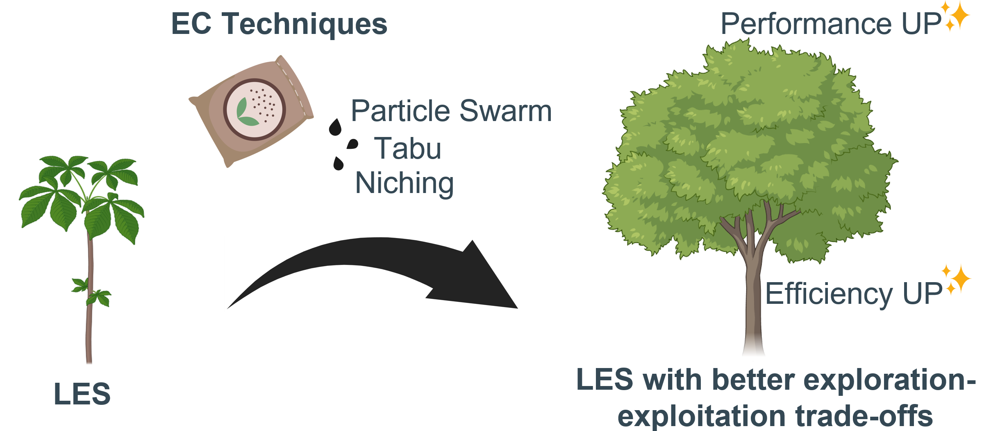
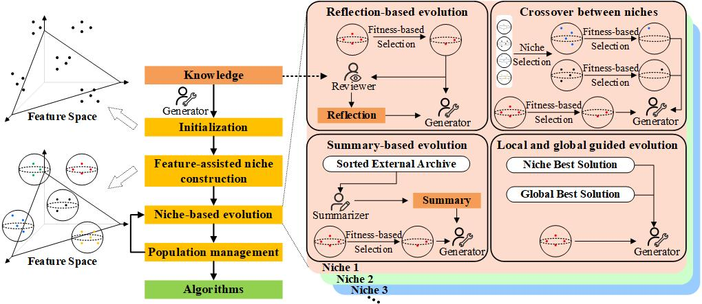

<div align="center">
<h1 align="center">
PartEvo: Partition to Evolution 
</h1>
<h3 align="center">
A Niching-enhanced Evolution with LLMs for Automated Algorithm Discovery
</h3>

[](https://neurips.cc/)
[]()
[]()

**[ [Paper](https://neurips.cc/virtual/2025/loc/san-diego/poster/118312) ]**
</div>
<br>

**TL;DR:** **PartEvo** (*Partition to Evolve*) is a novel framework that deeply integrates Large Language Model-assisted Evolutionary Search (LES) with **Niching strategies**. It significantly boosts the efficiency and efficacy of Automated Algorithm Discovery (AAD) in abstract language spaces, ultimately proving that **Advanced Evolutionary Computation (EC) techniques are critical for unlocking the full potential of LES.**

<p align="center">

</p>

---
## 📢 News
* **[2026-03]** 🔥 PartEvo has been integrated into the **[LLM4AD](https://github.com/Optima-CityU/llm4ad)** platform! LLM4AD is a comprehensive library for LLM-assisted algorithm design. You can now easily benchmark PartEvo against various other LLM-assisted Evolutionary Search methods. We welcome you to try it out!
* **[2025-09]** 🎉 Our paper *"Partition to Evolve: Niching-enhanced Evolution with LLMs for Automated Algorithm Discovery"* has been accepted by **NeurIPS 2025**!

---

## 📖 Introduction: The "Language Space" Challenge

Early LES methods (such as EoH and ReEvo) have successfully demonstrated the feasibility of using LLMs as intelligent algorithm designers. However, they often rely on oversimplified search mechanisms (e.g., greedy selection), which severely limits their exploration efficiency. 

In traditional Evolutionary Computation (EC), search efficiency is heavily reliant on balancing the exploration-exploitation trade-off. This is often achieved through sophisticated computational resource allocation techniques, such as **niching** and **search space partitioning**. 

It is natural to want to adapt these proven EC techniques to LES. However, doing so introduces a fundamental roadblock.

### 🚧 The Challenge: Distance in Language
With LLMs, the search space extends beyond traditional numerical or manually designed discrete spaces into **abstract language spaces**. 
* **Numerical Spaces:** Niches are easily defined using explicit dimensionality and mathematical distance thresholds.
* **Language Spaces:** They lack explicit dimensionality and well-defined structures. It is inherently challenging to compute the "distance" between two algorithm scripts, hindering the direct application of niche-based EC techniques. 

### 💡 The PartEvo Solution
To address these challenges, we present **PartEvo**, a practical pipeline that brings advanced EC strategies into the LLM era:

1. **Language Space Partitioning:** We introduce a method to effectively partition unstructured language search spaces and construct distinct "niches" for algorithm populations.
2. **Seamless Integration:** These niches are integrated into a general LES framework, enabling a highly effective allocation of sampling resources (i.e., your valuable queries to the LLM) during the search process.
3. **A Methodological Blueprint:** PartEvo significantly improves search efficiency under limited sampling budgets. More importantly, it establishes a foundational blueprint for incorporating a diverse range of advanced EC methods into future LES pipelines.

<p align="center">

</p>

---


## ⚙️ Requirements & Installation

You can quickly set up the required Python environment using the provided `environment.yaml` file.

1.  **Create the Conda environment**:
    ```bash
    conda env create -f environment.yaml
    ```

2.  **Activate the environment**:
    ```bash
    conda activate llm4ad_yaml
    ```

---

## 💻 Quick Start

> [!Note]
> Before running the script, you'll need to configure your Large Language Model (LLM) API settings. Here's an example configuration for DeepSeek:
>
> 1.  Set `host`: `'api.deepseek.com'`
> 2.  Set `key`: `'your_api_key'` (Replace with your actual API key)
> 3.  Set `model`: `'deepseek-chat'`

In just about an hour of automated discovery, the following script will use PartEvo to evolve a high-performing algorithm for the **Online Bin Packing (OBP)** problem.

```python
from llm4ad.task.optimization.online_bin_packing import OBPEvaluation
from llm4ad.tools.llm.llm_api_https import HttpsApi
from llm4ad.method.partevo import PartEvo
from llm4ad.method.partevo import PartEvoProfiler


# =========================================================================
# 1. LLM Configuration
# Set up the Large Language Model that will act as our "Algorithm Designer".
# =========================================================================
llm = HttpsApi(host='xxxx',
               # Replace with your API endpoint (e.g., api.openai.com/v1/completions, api.deepseek.com)
               key='xxx',  # Replace with your actual API key
               model='xxx',  # Choose your model (e.g., gpt-4o, deepseek-chat)
               timeout=120  # Maximum waiting time for LLM response
               )

# =========================================================================
# 2. Task Evaluation Setup
# Link the environment instances to our custom MoonLander evaluator.
# =========================================================================
run_mode = 'Training'  # Options: 'Training' (evolution), 'Using' (testing), 'Combined'
using_algo_designed_path = ""  # Path to a saved policy if run_mode is 'Using'
task = OBPEvaluation()

# Directory where evolution logs and generated policies will be saved
log_dir = f'logs/partevo'  # Use run_id to avoid overwriting logs

# Initial population file containing base heuristic code to kickstart evolution
local_algo_base = ''

method = PartEvo(llm=llm,
                 profiler=PartEvoProfiler(log_dir=log_dir, log_style='simple', run_mode=run_mode,
                                          using_algo_designed_path=using_algo_designed_path),
                 evaluation=task,
                 max_sample_nums=500,
                 max_generations=None,
                 pop_size=16,
                 operators=('re', 'se', 'cn', 'lge'),   # ('re', 'se', 'cn', 'lge'),
                 num_samplers=4,
                 num_evaluators=4,
                 partition_method='kmeans',
                 partition_number=4,
                 local_algo_base=local_algo_base,
                 feature_used=('ast',),
                 debug_mode=False)

method.run()
```

## 🛠️ Adapting PartEvo to Your Custom Scenarios
PartEvo is built to be highly versatile. To construct your own algorithm design tasks or apply PartEvo to entirely new domains, please refer to the comprehensive guidelines provided in the LLM4AD Platform Documentation. The modular design of the platform makes it seamless to plug PartEvo into your custom task templates!

## ✨Citation

If you find PartEvo helpful in your research, please consider citing our paper:
```bibtex
@inproceedings{hu2025partition,
  title={Partition to evolve: Niching-enhanced evolution with llms for automated algorithm discovery},
  author={Hu, Qinglong and Zhang, Qingfu},
  booktitle={The Thirty-ninth Annual Conference on Neural Information Processing Systems},
  year={2025}
}
```

