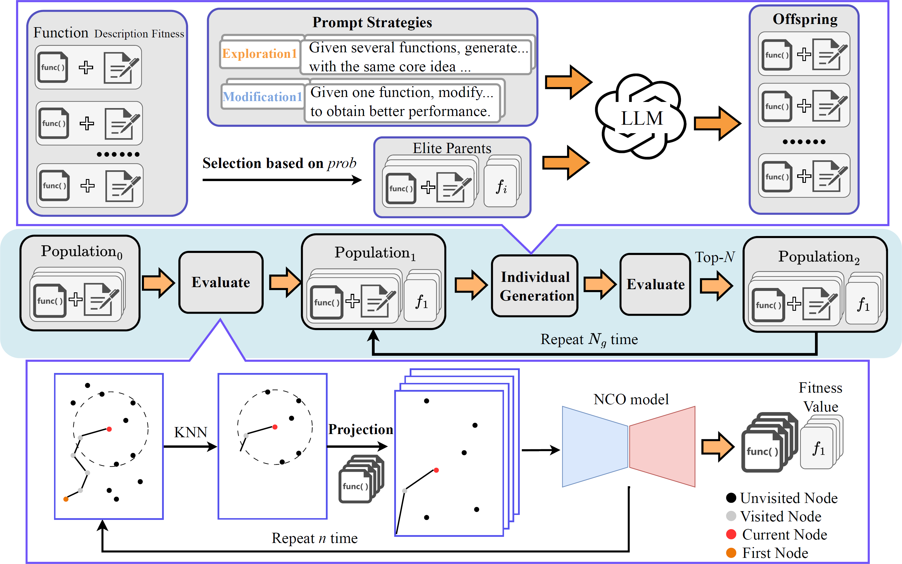

# Improving Generalization of Neural Combinatorial Optimization for Vehicle Routing Problems via Test-Time Projection Learning

This repository contains the official implementation of the paper "[Improving Generalization of Neural Combinatorial Optimization for Vehicle Routing Problems via Test-Time Projection Learning](https://arxiv.org/abs/2506.02392)" accepted by NeurIPS 2025.

## Introduction

Neural Combinatorial Optimization (NCO) models often struggle with generalization when deployed on test distributions that differ from training data. To address this challenge, we introduce **Test-Time Projection Learning (TTPL)**, a novel framework that leverages Large Language Models (LLMs) to automatically discover projection functions that bridge the gap between training and testing distributions.

### Key Features

- **Zero Retraining Required**: Unlike traditional domain adaptation methods, TTPL operates exclusively during inference, eliminating the need for model retraining or fine-tuning.
- **LLM-Driven Discovery**: Automatically searches for effective projection functions using state-of-the-art LLMs and optimization algorithms.
- **Enhanced Scalability**: Significantly improves the performance of pre-trained NCO models on out-of-distribution problem instances.
- **Plug-and-Play**: Seamlessly integrates with existing NCO models without modifying their architecture.



### Acknowledgments

This implementation builds upon code from:
- [LLM4AD](https://github.com/Optima-CityU/LLM4AD)
- [LEHD](https://github.com/CIAM-Group/NCO_code/tree/main/single_objective/LEHD)

We gratefully acknowledge their contributions to the research community.
## How to Run

### Dataset Preparation

Download the benchmark datasets for TSP and CVRP from Google Drive:

📦 [**Download Dataset**](https://drive.google.com/file/d/1MsyjgFe7yyB8LnQ_XBbQM3IOIXwVB_xK/view?usp=drive_link)

After downloading, extract the dataset and place it in the appropriate directory according to the workspace structure.

### Testing Existing Projections

You can directly test the effectiveness of our projection functions on both TSP and CVRP instances.

#### Testing TSP

Run the following command to test projection functions on TSP instances:

```bash
python lehd/TSP/test_tsp.py [arguments]
```

**Examples:**

```bash
# Test on synthetic TSP instances with 1000 cities
python lehd/TSP/test_tsp.py --problem_size 1000 --projection projection_1k

# Test on TSPlib benchmark instances
python lehd/TSP/test_tsp.py --problem_size 0 --test_in_tsplib True --projection projection_5k
```

**Key Arguments:**

*   `--problem_size`: The size of the problem instances.
*   `--projection`: The name of the projection function to use (defined in `lehd/TSP/projection.py`).

#### Testing CVRP

Similarly, to test the projection on CVRP instances, run the `test_cvrp.py` script:

```bash
python lehd/CVRP/test_cvrp.py [arguments]
```

**Examples:**

```bash
# Test on synthetic CVRP instances with 1000 customers
python lehd/CVRP/test_cvrp.py --problem_size 1000 --projection projection_1k

# Test on CVRPlib benchmark instances
python lehd/CVRP/test_cvrp.py --problem_size 0 --test_in_vrplib True --projection projection_10k
```

**Key Arguments:**

*   `--problem_size`: The size of the problem instances.
*   `--projection`: The name of the projection function to use (defined in `lehd/CVRP/projection.py`).

### Discovering New Projections with TTPL

The TTPL framework can automatically search for optimal projection functions tailored to your specific problem instances and distributions.

#### Running the Search

```bash
python llm4ad/run_TTPL.py
```

#### Configuration

Before running the search, configure the following parameters in `llm4ad/run_TTPL.py`:

| Parameter | Description | Example Values |
|-----------|-------------|----------------|
| `PROBLEM_TYPE` | Problem domain | `"tsp"` or `"cvrp"` |
| `llm` | LLM configuration | API host, key, model name |
| `method` | Optimization method | `"EoH"`, `"FunSearch"`, etc. |

## Contact

For questions, issues, or suggestions regarding the implementation, please:
- Open an issue on GitHub
- Contact the author: Rongsheng Chen via email

We welcome contributions and feedback from the community!